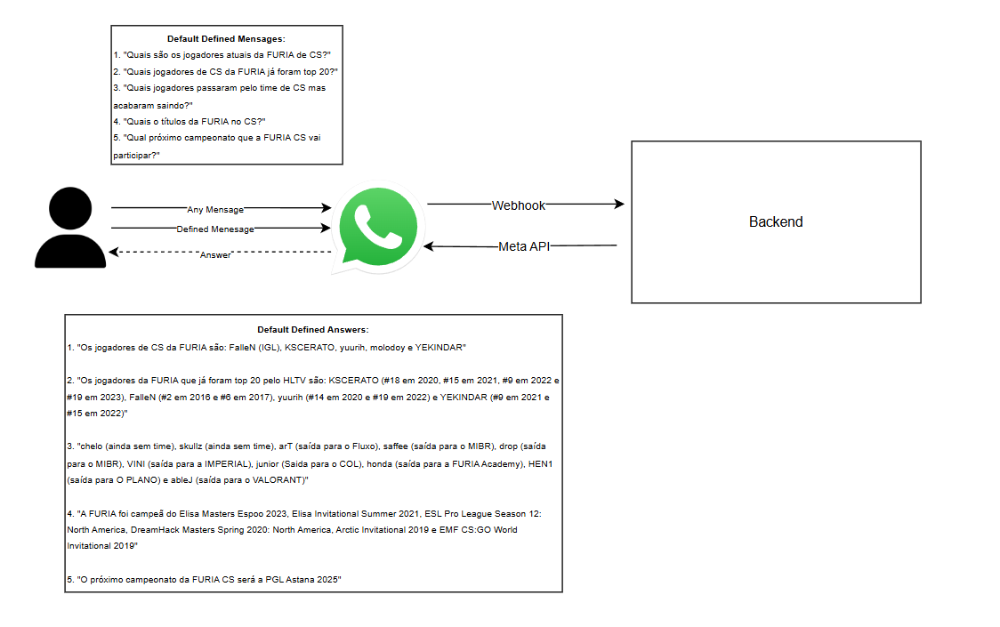

# Challenge #1 - Experiência Conversacional FURIA

## 🛠️ Tecnologias Utilizadas

| Tecnologia | Justificativa |
|------------|----------------|
| **WhatsApp Cloud API (Meta)** | Canal de comunicação oficial com WhatsApp, gratuito para protótipos e confiável |
| **OpenAI API (GPT-3.5)** | Responde perguntas genéricas fora do escopo definido, ampliando a experiência |
| **Axios** | Cliente HTTP simples e moderno para chamadas à API da Meta e OpenAI |
---

## Fluxo da Aplicação

1. **Usuário envia mensagem no WhatsApp**
2. **API da Meta chama seu Webhook HTTP (POST /webhook)**
3. **Servidor processa o conteúdo da mensagem recebida**
4. **Se for uma das perguntas pré-definidas → responde com base local**
5. **Se for algo novo → consulta a API da OpenAI**
6. **Envia a resposta de volta ao usuário pelo WhatsApp**

---

## Mensagens com Resposta Direta (default)

As seguintes perguntas são reconhecidas diretamente pelo sistema:

- `Quais são os jogadores atuais da FURIA de CS?`
- `Quais jogadores de CS da FURIA já foram top 20?`
- `Quais jogadores passaram pelo time de CS mas acabaram saindo?`
- `Quais os títulos da FURIA no CS?`
- `Qual próximo campeonato que a FURIA CS vai participar?`

Caso a mensagem não corresponda a nenhuma das acima, é feita uma busca na internet via OpenAI com a seguinte resposta padrão:

> O sistema não possui essa informação por default, mas buscando na internet: **[resposta da IA]**

---
Variáveis de Ambiente
~~~
WPP_PHONE_NUMBER_ID=YOUR_PHONE_ID
WPP_TOKEN=YOUR_META_ACCESS_TOKEN
OPENAI_API_KEY=YOUR_OPENAI_API_KEY
~~~ 

--- 
## Arquitetura
